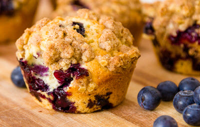

# [index.html](../index.html)
```html=
<!--宣告檔案類型-->
<!DOCTYPE html>
<html>
	<!-- 標頭 -->
	<head>
		<title>Cafe Unlimited - Home</title>
		<!-- Javascript Code -->
		<script>function bigger() { document.getElementById("body").style.fontSize = "x-large"; } function smaller() { document.getElementById("body").style.fontSize = "medium"; }</script>
		<!-- CSS Code -->
		<style>h1 { font-family: fantasy; color: slategray; } p { font-family: sans-serif; color: rgb(0, 0, 128); } li { font-family: sans-serif; color: #000080; }</style>
	</head>
	<!--內容-->
	<body id="body"
							style="background-image: url(images/background.png)">
		<!-- Banner -->
		<p>
			
		</p>
		<!-- Navigation links -->
		<p style="background: slategray; font-weight: bolder">
			<a href="index.html">Home</a>
			<a href="breakfast.html">Breakfast</a>
		</p>
		<!-- Breakfast photos -->
		<p>
			
			
		</p>
		<!-- Javascript -->
		<!-- Bigger Button -->
		<button onclick="bigger()"
										type="button">Bigger</button>
		<!-- Smaller Button -->
		<button onclick="smaller()"
										type="button">Smaller</button>
		<h1>Welcome</h1>
		<p>Welcome to Cafe Unlimited. We serve award-winning breakfasts and lunches, with unlimited coffee, tea, and soft drinks. Freshly baked muffins, signature omelets, healthy salads, delicious burgers and hearty sandwiches are just some of the
		delicious items on our menu. We were voted the 
		<span style="color: red; font-style: italic">the #1 Breakfast and Lunch restaurant</span>downtown!</p>
		<p>We want to make you 
		<span style="color: red; font-style: italic">feel at home</span>from the minute you walk in the door. Be part of the Cafe Unlimited family! Have a great meal, relax, socialize, and come back again soon!</p>
		<p>We offer delivery on 
		<a href="http://ubereats.com"
					target="_blank">UberEats</a>. Download the app and place your order today. Please contact us about catering services.</p>
		<p>We are located at 20 Channel Center Street in Boston, MA.</p>
		<iframe allowfullscreen="allowfullscreen"
										frameborder="0"
										height="450"
										src="https://www.google.com/maps/embed?pb=!1m18!1m12!1m3!1d2948.8366673124624!2d-71.05369318489703!3d42.346005543982265!2m3!1f0!2f0!3f0!3m2!1i1024!2i768!4f13.1!3m3!1m2!1s0x89e37a7de82a1251%3A0xb79b53cf96e26c94!2s20+Channel+Center+St%2C+Boston%2C+MA+02210!5e0!3m2!1sen!2sus!4v1543445329233"
										style="border: 0"
										width="600"></iframe>
		<p>We are open:</p>
		<ul>
			<li>Saturday and Sunday, 7 am to 2 pm</li>
			<li>Monday through Friday, 6 am to 2 pm</li>
		</ul>
		<p>Visit our contact page for directions and contact information.</p>
		<h1>Find Us, Follow Us</h1>
		<p>Follow us on 
		<a href="http://facebook.com"
					target="_blank">Facebook</a>and 
		<a href="http://twitter.com"
					target="_blank">Twitter</a>. Check out our reviews on 
		<a href="http://yelp.com"
					target="_blank">Yelp.</a></p>
		<p>Find us in Channel Center.</p>
		<p>Cafe Unlimited 
		<br />617-555-1234 
		<br />cafeunlimited@example.com</p>
	</body>
</html>
```

# [breakfast.html](../breakfast.html)
```html=
<!DOCTYPE html>
<html>
	<head>
		<title>Cafe Unlimited - Breakfast</title>
		<!-- CSS Code -->
		<style>h1 { font-family: fantasy; color: #448ccb; /* banner blue */ } h2 { font-family: fantasy; color: #ffbe42; /* banner orange */ } p { font-family: sans-serif; color: darkslategray; } li { font-family: sans-serif; color: darkslategray;
		}</style>
	</head>
	<body style="background-color: lightsteelblue">
		<!-- Banner -->
		<p>
			
		</p>
		<!-- Navigation links -->
		<p style="background: slategray; font-weight: bold">
			<a href="index.html">Home</a>
			<a href="breakfast.html">Breakfast</a>
		</p>
		<h1>Pancakes</h1>
		<h2>The Short Stack</h2>
		<p>Three fluffy pancakes served with powdered sugar, maple syrup, and butter.</p>
		<h2>The Blueberry Stack</h2>
		<p>Three golden brown pancakes prepared on the griddle with fresh Maine blueberries.</p>
		<h2>The Chocolate Dream</h2>
		<p>Three large pancakes with warm chocolate chips, served with whipped cream and chocolate sauce for a decadent breakfast treat.</p>
		<h1>Eggs</h1>
		<h2>The Classic</h2>
		<p>One or two eggs, cooked any style, with hash brown potatoes and your choice of toast.</p>
		<h2>The Omelet</h2>
		<p>We'll combine your choice of fresh meats, vegetables, and cheeses with three large eggs to make your favorite omelet. Served with hash brown potatoes and your choice of toast.</p>
		<h1>Sides and Specials</h1>
		<p>Add any of these sides or specials to your breakfast:</p>
		<!-- unordered list -->
		<ul>
			<!-- list item -->
			<li>Bagel and Cream Cheese</li>
			<li>Freshly baked blueberry muffins</li>
			<li>Bacon or Sausage</li>
			<li>Fresh fruit salad</li>
		</ul>
		<!-- Youtube Video -->
		<iframe allow="accelerometer; autoplay; encrypted-media; gyroscope; picture-in-picture"
										allowfullscreen="allowfullscreen"
										frameborder="0"
										height="315"
										src="https://www.youtube.com/embed/LWuuCndtJr0"
										width="560"></iframe>
	</body>
</html>
```

# [fonts.html](../fonts.html)
```html=
<!DOCTYPE html>
<html lang="en">
	<!-- 標頭 -->
	<head>
		<title>Fonts and Styles</title>
	</head>
	<!-- 內容 -->
	<body>
		<!-- Paragraph -->
		<p></p>
		<p style="font-family: sans-serif; color: red; background: yellow">Sans-Serif Font, Green Text, Yellow Background</p>
		<p style="font-family: serif">Hello!</p>
		<p style="font-family: sans-serif">Hello!</p>
		<p style="font-family: monospace">Hello!</p>
		<p style="font-family: cursive">Hello!</p>
		<p style="font-family: fantasy; color: ch">Hello!</p>
		<p>This sentence contains a 
		<span style="background-color: yellow">highlighted</span>word.</p>
	</body>
</html>

```

# [media.html](../media.html)
```html=
<!DOCTYPE html>
<html>
	<!-- 標頭 -->
	<head>
		<title>Audio and Video</title>
	</head>
	<!-- 內容 -->
	<body>
		<!-- 音樂 -->
		<h1>Audio</h1>
		<audio autoplay=""
									controls="">
		<source src="media/music.mp3"
										type="audio/mpeg" />Your browser does not support the audio element.</audio>
		<!-- 影片 -->
		<h1>Video</h1>
		<video controls=""
									height="240"
									width="320">
		<source src="media/breakfast.mp4"
										type="video/mp4" />Your browser does not support the video tag.</video>
	</body>
</html>

```
